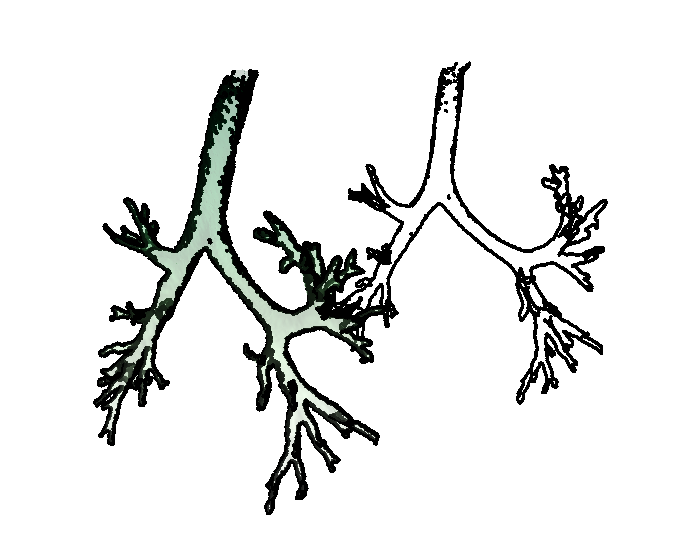
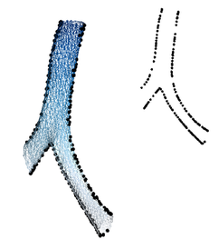
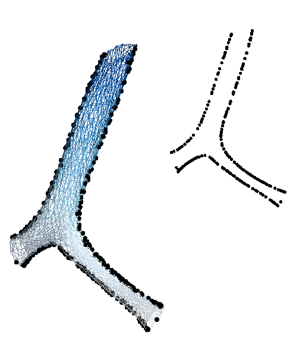
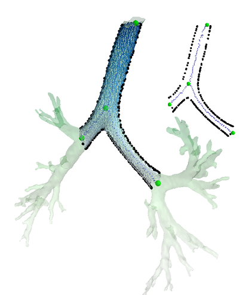

Mesh and Principal Component Silhouette Projection
==========================

***NB! [Still incomplete. Creation of examples, instructions and cleaning up of the code is still in progress]***


This is the demo code for the following paper, 

Benjamin Irving, Tania Douglas, Paul Taylor. 2D X-ray airway tree segmentation by 
3D deformable model projection and registration

To be presented at the Fifth International Workshop on Pulmonary Image Analysis (www.lungworkshop.org)

##Dependencies

Python libraries:
- time, copy, os
- pickle
- matplotlib
- numpy
- scipy
- mayavi


##Installation

The c++ component needs to first be compiled for your os and wrapped for python using swig. 
(Only tested on linux so far)

- Requirements: swig

Using linux:

``` bash
cd mesh3D_mod
swig -c++ -python -o sc_wrap.cpp sc.i
gcc -fPIC $(python-config --includes) -c sc_wrap.cpp sc.cpp
g++ -shared sc_wrap.o sc.o -o _sc.so
```

sc.i - Settings that define the swig compilation
sc.cpp -c++ class code. 
sc.py - Automatically created. Provides the link between the two languages. 

This c++ object is now callable from the python 3D processing class. 

##Running Examples
Example 1 - Finding a mesh silhouette:
`python Example1_mesh_silhouette_and_projection.py`

Example 2 - Plotting example variation of the statistical shape model:
`python Example2_pca_mesh.py`

Example 3 - Projecting the mean statistical shape model along with landmark points and centreline:
`python Example3_centreline_landmark_projection.py`

Example 4 - Rigid alignment

Example 5 - Shape optimisation

...

##Example Outputs

Example 1:



Example 2 - Example variation 3 standard deviations along the 2nd mode of variation: 



Example 3:


